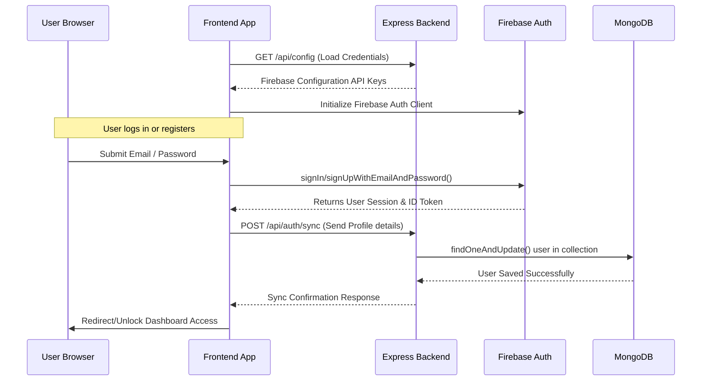

# 📖 NurulQuran – Complete Islamic Learning & Quran Companion Platform

**Project Metadata:**
- **Active Module:** Module 2 (Quran & Islamic Features)
- **Development Timeline:** July 27th – August 02nd, 2026

Welcome to **NurulQuran**, a premium, modern, and highly interactive digital companion for Quran study, prayer time tracking, daily habit streaks, and structured Islamic learning modules.

This codebase represents the completed features of **Module 2 (Quran & Islamic Features)** built on top of the Module 1 project foundation. It leverages a decoupled, lightweight design where the frontend (vanilla CSS, HTML, and JS) integrates seamlessly with an Express backend and a MongoDB database, utilizing Firebase Authentication for user accounts.


---

## 🧭 Architecture & System Flow

NurulQuran features a secure decoupled architecture. The frontend application fetches Firebase client configurations dynamically from the server, eliminating the need to hardcode API keys on the client side.



---

## 📂 Project Structure

Here is a detailed breakdown of the codebase:

*   **[index.html](file:///c:/Users/asada/Desktop/ZYNAX%20SOLUTION%20PROJECT/index.html)**: The landing homepage featuring a glassmorphism navbar, hero call-to-action (CTA), interactive Daily Verse & Prayer Times widgets, learning module cards, and the embedded login/signup authentication modal.
*   **[dashboard.html](file:///c:/Users/asada/Desktop/ZYNAX%20SOLUTION%20PROJECT/dashboard.html)**: The protected client dashboard. It uses a client-side locking mechanism to protect content from logged-out visitors. Once authorized, it displays personalized statistics (streaks, memorized verses, completed lessons), current module learning progress, a clickable prayer checklist, and a detailed profile card.
*   **[styles.css](file:///c:/Users/asada/Desktop/ZYNAX%20SOLUTION%20PROJECT/styles.css)**: Centralized style repository using CSS Custom Properties (variables) for theme control. Implements beautiful glassmorphism classes (`.glass`), smooth pulse animations, custom scrollbars, and fluid slide-up/fade-in modal transitions. It also handles system-level dark-mode defaults.
*   **[app.js](file:///c:/Users/asada/Desktop/ZYNAX%20SOLUTION%20PROJECT/app.js)**: Client-side logic that orchestrates page transitions, dynamically updates user states across elements, handles Firebase Authentication, and sends session synchronizations to the backend.
*   **[server.js](file:///c:/Users/asada/Desktop/ZYNAX%20SOLUTION%20PROJECT/server.js)**: Backend Node.js / Express web server. Safely serves environmental configs to the frontend, manages the Mongoose schema connection, and synchronizes accounts to the MongoDB cluster.
*   **[package.json](file:///c:/Users/asada/Desktop/ZYNAX%20SOLUTION%20PROJECT/package.json)**: Node manifest containing package metadata, npm start script, and dependencies (`express`, `cors`, `mongoose`, `dotenv`).
*   **[.env.example](file:///c:/Users/asada/Desktop/ZYNAX%20SOLUTION%20PROJECT/.env.example)**: Blueprint configuration template containing standard keys required for authentication and database synchronization.

---

## 🛠️ Technology Stack

| Component | Technology | Description |
| :--- | :--- | :--- |
| **Frontend Layout** | **HTML5 Semantic elements** + **Tailwind CSS v3 (CDN)** | Rapid utility-first styling coupled with semantic tags for accessibility & SEO. |
| **Frontend Logic** | **Vanilla ES6 Javascript** | Modules maps imports, native asynchronous fetches, and reactive DOM updates. |
| **Authentication** | **Firebase Client SDK (v10)** | Secure client-side login, token generation, and persistence. Loaded via official Google CDN. |
| **Backend Framework**| **Node.js + Express.js** | Fast, unopinionated server to bridge configuration and synchronize user states. |
| **Database & ORM** | **MongoDB Atlas + Mongoose** | Cloud-native Document database with schema enforcement for persistent user accounts. |

---

## ⚙️ Configuration & Environment Variables

Copy the template file `.env.example` in the project root to create your private `.env` configuration file:

```bash
cp .env.example .env
```

Ensure the following variables are defined in your `.env`:

```env
# Firebase Credentials (Get these from your Firebase console -> Project Settings)
FIREBASE_API_KEY=your_firebase_api_key
FIREBASE_AUTH_DOMAIN=your_project_id.firebaseapp.com
FIREBASE_PROJECT_ID=your_project_id
FIREBASE_STORAGE_BUCKET=your_project_id.appspot.com
FIREBASE_MESSAGING_SENDER_ID=your_sender_id
FIREBASE_APP_ID=your_app_id

# MongoDB connection string
MONGODB_URI=mongodb+srv://<username>:<password>@cluster.mongodb.net/nurulquran?retryWrites=true&w=majority

# Backend Server Listening Port (defaults to 5000)
PORT=5000
```

> [!IMPORTANT]
> **Firebase Authentication setup requirement:**
> Go to the [Firebase Console](https://console.firebase.google.com/), select your project, go to **Authentication > Sign-in method**, and enable the **Email/Password** provider. Without this, user authentication requests will fail.

> [!TIP]
> **Mock Authentication Fallback (Zero-Config Test Mode):**
> If you do not have a Firebase project or MongoDB cluster set up yet, you can still run and test the complete sign-up, sign-in, sign-out, and dashboard flows out of the box!
> When the application detects that the `.env` configuration file is missing, unreachable, or configured with dummy `"mock-*"` credentials, it automatically enables **Mock Authentication Fallback**.
> - **Sign Up:** Any valid name, email, and a password of at least 6 characters will create a mock account saved locally to your browser's `localStorage`.
> - **Sign In:** Enter the registered email and password to log in.
> - **Dashboard Unlocking:** Once logged in (either via real Firebase or the mock fallback), the dashboard content is fully unlocked and personalized with the user's name.
> - **MongoDB Sync:** If the backend is running but MongoDB is offline, sync details will fail gracefully in the background console without breaking the login state.

---

## 🚀 Setup & Local Startup Guide

Follow these steps to run the server and client applications concurrently:

### 1. Install Server Dependencies
In your terminal, navigate to the project directory and install the Node modules:
```bash
npm install
```

### 2. Start the Express Backend
Launch the server. By default, it runs on port `5000` and initializes the MongoDB database connection:
```bash
npm start
```
Upon success, the terminal output will read:
```text
Successfully connected to MongoDB
NurulQuran Server is running on port: 5000
Serve Firebase configs at: http://localhost:5000/api/config
```

### 3. Open the Frontend Application
Run the frontend via one of the following methods:
*   **VS Code Live Server Extension (Recommended)**: Right-click `index.html` and choose **Open with Live Server** (usually runs on port `5500` at `http://127.0.0.1:5500/index.html`).
*   **Double-click file**: Open `index.html` directly in your browser. (Note: Using a local web server like Live Server is recommended to ensure CORS and relative paths function correctly).

---

## 🔌 API Endpoints Reference

### 1. Serve Firebase Configuration
*   **Route:** `GET /api/config`
*   **Description:** Returns the public Firebase configuration keys needed by the client.
*   **Response (`200 OK`):**
    ```json
    {
      "apiKey": "AIzaSy...",
      "authDomain": "nurulquran-app.firebaseapp.com",
      "projectId": "nurulquran-app",
      "storageBucket": "nurulquran-app.appspot.com",
      "messagingSenderId": "123456789",
      "appId": "1:12345:web:abcd"
    }
    ```
*   **Error Response (`500 Internal Server Error`):**
    ```json
    { "error": "Firebase configurations are missing on server .env file." }
    ```

### 2. Sync User Auth Data
*   **Route:** `POST /api/auth/sync`
*   **Headers:**
    *   `Content-Type: application/json`
    *   `Authorization: Bearer <Firebase_ID_Token>`
*   **Request Body:**
    ```json
    {
      "uid": "user_firebase_uid_string",
      "email": "user@example.com",
      "displayName": "Full Name",
      "photoURL": "https://example.com/avatar.jpg"
    }
    ```
*   **Response (`200 OK`):**
    ```json
    {
      "success": true,
      "user": {
        "_id": "60c72b2f9b1d8a0015c9d4b3",
        "uid": "user_firebase_uid_string",
        "email": "user@example.com",
        "displayName": "Full Name",
        "photoURL": "https://example.com/avatar.jpg",
        "lastLoginAt": "2026-07-24T11:37:16.000Z",
        "createdAt": "2026-07-24T11:30:00.000Z",
        "updatedAt": "2026-07-24T11:37:16.000Z",
        "__v": 0
      }
    }
    ```
*   **Error Responses:**
    *   `400 Bad Request`: `{ "error": "Missing required fields: uid or email" }`
    *   `503 Service Unavailable`: `{ "error": "MongoDB connection is currently offline." }`
    *   `500 Internal Server Error`: `{ "error": "Database synchronization failed", "details": "..." }`

## 🕋 Module 2: Quran Companion Features
This module integrates public Quranic scripture database streams and standard HTML5 audio components into the frontend page flow:

*   **API Parallel Fetching:** Leverages Al Quran Cloud's joint editions fetch endpoint (`/v1/surah/{number}/editions/quran-uthmani,en.sahih,{reciterId}`) to obtain original Arabic text, English translation, and audio streams in a single HTTP request, reducing latencies.
*   **Surah Search Directory:** Scrollable sidebar selector listing all 114 Surahs. Includes a regex search filter box allowing users to instantly filter Surahs by Name, Revelation Number, or Revelational Meaning.
*   **Custom Font Resizing:** Dynamic size adjuster controllers on the reader pane allowing fine-grained scale manipulation of Arabic scripture text for accessibility and readability.
*   **Parallel Translation Toggles:** Standard toggles showing or hiding the Sahih International English translation lines dynamically.
*   **Sticky Audio Player Bar:** A fixed media controller container appearing smoothly at the screen bottom upon verse playback. Features:
    *   **Autoplay Next (Continuous Play):** The player automatically queues and plays the next verse in the Surah once the active verse ends.
    *   **Visual Synchronisation:** Automatically highlights the active playing verse on the screen with a golden border and emerald background, and auto-scrolls it smoothly into view.
    *   **Controls:** Play/Pause, Next/Prev verse buttons, volume progress, mute toggles, seek/scrubbing range slider, and a Qari selector dropdown.
    *   **Qari Choices:** Includes streams from Mishary Alafasy, Abdul Basit (Mujawwad), Abu Bakr al-Shatri, Ali Al-Hudhaify, and Mahmoud Al-Husary.

---

## 🎨 UI/UX Styling Features

*   **Glassmorphism Effects:** Using `backdrop-filter: blur(12px)` and translucent borders, styled using utility Tailwind CSS classes and customized inside `styles.css` (`.glass`).
*   **Theme Integration:** Respects system-level preferences with automatic dark-mode setup based on `@media (prefers-color-scheme: dark)`.
*   **Arabic Typography:** Imports high-quality Arabic calligraphic style font (`Amiri`) to render Quranic verses elegantly (`.quran-text`).
*   **Smooth Animations:** Implements premium feel with micro-animations such as `@keyframes pulse-gold` for indicators, along with `@keyframes fadeIn` and `@keyframes slideUp` for the modal display lifecycle.

---

## 🛠️ Troubleshooting & Common Issues

*   **Express Server Unreachable Warning**: If the client prints a console warning `Express backend not running or unreachable`, make sure the backend is active on port `5000` via `npm start`. If running the client on a custom host/port, check that CORS permissions are not blocking localhost communication.
*   **MongoDB Connection Error**: Confirm your local IP address is whitelisted in MongoDB Atlas under Network Access, and verify that the `MONGODB_URI` string contains the correct username, password, and database name.
*   **Firebase Initialisation Failures**: Double check the spelling of key credentials inside your `.env` file, and ensure they match the values listed in your Firebase project console.
