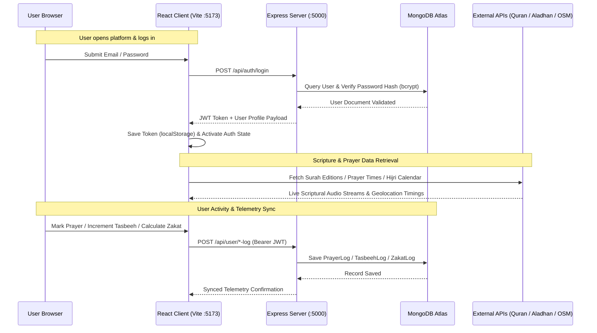
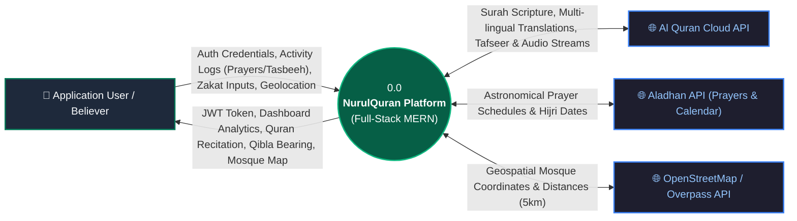

# 📖 NurulQuran – Complete Islamic Learning & Quran Companion Platform

**Project Metadata:**
- **Project Structure:** 6-Week Structured Development Program
- **Completed Milestones:** Week 1 (Project Foundation & UI/UX), Week 2 (Quran & Audio Recitation Engine), Week 3 (Prayer & Geospatial Features), Week 4 (Faith & Knowledge Suite), Week 5 (Calculators, Mosque Finder & QA Suite), Week 6 (Full-Stack MERN Architecture, JWT Security & Cloud Persistence)
- **Development Timeline:** 6 Weeks (July 20th – August 31st, 2026)

Welcome to **NurulQuran**, a modern, full-stack Islamic learning platform and comprehensive Quran companion built on the **MERN Stack** (MongoDB, Express.js, React 18, Node.js) with **Vite** and **Tailwind CSS**.

The platform offers an immersive experience featuring authentic Quranic recitation with side-by-side English/Urdu translations and inline Urdu Tafseer, dynamic prayer times with GPS geolocation and juristic calculation settings, an interactive 3D/compass rose Qibla direction finder, a tactile Tasbeeh counter with activity analytics, a dynamic Hijri calendar, step-by-step Namaz guide, an interactive Mosque locator with OpenStreetMap integration, and an automated Zakat calculator. User authentication and activity logs (prayers, tasbeeh counters, zakat calculations, and bookmarks) persist securely in MongoDB with JWT authorization and resilient offline fallbacks.

---

## 🧭 Architecture & System Flow

NurulQuran employs a modern, full-stack decoupled architecture. The frontend is a high-performance **React 18 Single-Page Application (SPA)** powered by **Vite** and **Tailwind CSS**, communicating with an **Express REST API** backend connected to **MongoDB Atlas via Mongoose**.



---

## 🔄 Data Flow Diagrams (DFD)

The following Data Flow Diagrams (DFDs) illustrate how user inputs, internal computational processes, persistent database collections, and third-party Islamic REST endpoints interact across the system:

### Level 0: Context Data Flow Diagram
The Level 0 diagram establishes the overall system boundary, external entities, and high-level input/output data flows:



### Level 1: Detailed Functional Data Flow Diagram
The Level 1 diagram decomposes the platform into 6 core computational processes, illustrating data movements between the user, external APIs, and persistent storage collections (MongoDB Atlas and Browser LocalStorage):

```mermaid
flowchart TD
    classDef entity fill:#1e293b,stroke:#047857,stroke-width:2px,color:#f8fafc;
    classDef process fill:#065f46,stroke:#10b981,stroke-width:2px,color:#ffffff;
    classDef datastore fill:#0f172a,stroke:#f59e0b,stroke-width:2px,color:#fef3c7;
    classDef external fill:#1e1e2e,stroke:#3b82f6,stroke-width:2px,color:#93c5fd;

    %% External Entities
    User["👤 Believer / Application User"]:::entity
    QuranAPI["🌐 Al Quran Cloud API"]:::external
    AdhanAPI["🌐 Aladhan REST API"]:::external
    OSMAPI["🌐 OpenStreetMap / Overpass API"]:::external

    %% Core System Processes
    subgraph Platform ["🕋 NurulQuran Functional Processes"]
        P1(["1.0 Authentication & JWT Session Management"]):::process
        P2(["2.0 Quran Reader, Search & Audio Engine"]):::process
        P3(["3.0 Prayer Times, Qibla & Mosque Discovery"]):::process
        P4(["4.0 Faith Utilities, Tasbeeh & Knowledge Suite"]):::process
        P5(["5.0 Zakat Calculation & Nisab Valuation"]):::process
        P6(["6.0 Telemetry Sync & Cloud Data Orchestration"]):::process
    end

    %% Data Stores
    D1[("D1: Users Collection (MongoDB)")]:::datastore
    D2[("D2: PrayerLogs Collection (MongoDB)")]:::datastore
    D3[("D3: TasbeehLogs Collection (MongoDB)")]:::datastore
    D4[("D4: ZakatLogs Collection (MongoDB)")]:::datastore
    D5[("D5: Browser LocalStorage (Offline Cache)")]:::datastore

    %% User Inflows
    User -->|"1. Credentials (Register / Login)"| P1
    User -->|"2. Surah Filter, Ayah Coordinates & Audio Play"| P2
    User -->|"3. GPS Coordinates & Juristic Calculation Rules"| P3
    User -->|"4. Tasbeeh Clicks, Daily Azkar Tally & TTS Triggers"| P4
    User -->|"5. Cash, Gold, Silver, Debt & Currency Selection"| P5
    User -->|"6. Settings Adjustments & Telemetry Updates"| P6

    %% User Outflows
    P1 -->|"JWT Token & Personalized Profile State"| User
    P2 -->|"Scriptural Arabic, English/Urdu Text, Tafseer & Audio"| User
    P3 -->|"Accurate Timings, Active Prayer Badge & Qibla Needle"| User
    P4 -->|"Vibration Feedback, Hijri Holiday Tooltips & Salah Steps"| User
    P5 -->|"Assessed Net Wealth, Zakat Due & Nisab Status"| User
    P6 -->|"Dashboard Analytics, Habit Streaks & Activity Heatmap"| User

    %% Third-party External Inflows/Outflows
    P2 <-->|"Joint Editions (Uthmani, Sahih, Maududi, Shamshad Ali Khan)"| QuranAPI
    P3 <-->|"Astronomical Timings & Official Hijri Calendar Data"| AdhanAPI
    P3 <-->|"Overpass Geospatial POI Mosque Markers (5km Radius)"| OSMAPI

    %% Data Store Inflows/Outflows
    P1 <-->|"Verify Password (bcrypt) & Save Profile"| D1
    P6 -->|"Persist Completed Daily Prayer Checklists"| D2
    P6 -->|"Persist Tasbeeh Daily Counts & History"| D3
    P6 -->|"Persist Zakat Assessment Calculations"| D4
    P6 <-->|"Cache Offline Fallbacks & Read Bookmarks"| D5
```



---

## 📂 Project Structure

The repository is organized into a modular full-stack structure with dedicated frontend, backend, and archived prototype directories:

*   **[index.html](file:///c:/Users/asada/Desktop/ZYNAX%20SOLUTION%20PROJECT/index.html)**: HTML5 entry point for the React single-page application. Mounts the root container and imports Google Fonts (`Amiri`, `Amiri Quran`, `Inter`, `Noto Nastaliq Urdu`) and Leaflet map stylesheets.
*   **[src/](file:///c:/Users/asada/Desktop/ZYNAX%20SOLUTION%20PROJECT/src)**: Frontend React 18 client application source:
    *   **`src/main.jsx` & `src/App.jsx`**: Application bootstrap, client routing (`/`, `/quran`, `/dashboard`, `/test`), and global providers (`AuthProvider`, `ThemeProvider`, `AudioProvider`).
    *   **`src/pages/`**: Primary page views:
        *   `HomePage.jsx`: Landing portal featuring hero banners, Daily Verse card, live Prayer Times preview, feature highlights, and module cards.
        *   `QuranReaderPage.jsx`: Full Quran reader with Surah directory, search engine, audio recitation player, side-by-side English/Urdu translations, and collapsible Urdu Tafseer.
        *   `DashboardPage.jsx`: Protected companion dashboard housing Tasbeeh counter, Hijri calendar, Namaz guide, Daily Azkar, Zakat calculator, Mosque locator map, and user profile management.
        *   `TestingPage.jsx`: Automated interactive verification console validating calculations, unit conversions, and API integration.
    *   **`src/components/`**: Reusable interface components including `Navbar.jsx`, `Footer.jsx`, `AudioPlayerBar.jsx` (sticky reciter bar with autoplay next), `AuthModal.jsx`, `PrayerTimesCard.jsx`, and `QiblaCompass.jsx`.
    *   **`src/context/`**: Global state management stores (`AuthContext.jsx`, `ThemeContext.jsx`, `AudioContext.jsx`).
    *   **`src/services/api.js`**: Axios client instance configured with automatic JWT interceptors and integration handlers for external APIs (Al Quran Cloud, Aladhan, Overpass OSM).
    *   **`src/data/`**: Static datasets including `booksData.js` (curated Islamic book library) and `hadithData.js`.
    *   **`src/index.css`**: Tailwind CSS theme directives, custom Islamic color tokens, and styling utilities.
*   **[server/](file:///c:/Users/asada/Desktop/ZYNAX%20SOLUTION%20PROJECT/server)**: Dedicated Express.js REST API service:
    *   **`server/src/server.js`**: Express application setup, CORS policy, Morgan HTTP request logging, and route mounting.
    *   **`server/src/config/db.js`**: MongoDB Mongoose connection manager supporting non-blocking resilient offline fallbacks.
    *   **`server/src/models/`**: Mongoose schemas for `User.js`, `PrayerLog.js`, `TasbeehLog.js`, and `ZakatLog.js`.
    *   **`server/src/controllers/`**: Controller logic for authentication (`authController.js`) and user telemetry (`userController.js`).
    *   **`server/src/routes/`**: API route definitions for authentication (`authRoutes.js`) and user features (`userRoutes.js`).
    *   **`server/src/middleware/auth.js`**: JWT Bearer verification middleware for protecting authenticated routes.
*   **[legacy/](file:///c:/Users/asada/Desktop/ZYNAX%20SOLUTION%20PROJECT/legacy)**: Preserved archive of earlier static vanilla JavaScript / HTML5 / CSS prototype files for historical reference.
*   **[package.json](file:///c:/Users/asada/Desktop/ZYNAX%20SOLUTION%20PROJECT/package.json)**: Root project configuration defining dependencies, Vite build commands, and concurrent server/client development scripts.

---

## 🛠️ Technology Stack

| Layer | Technology | Purpose & Implementation |
| :--- | :--- | :--- |
| **Frontend Framework** | **React 18 + Vite** | High-performance Single-Page Application (SPA) with lightning-fast HMR and optimized builds. |
| **Routing** | **React Router DOM v6** | Client-side routing with clean navigation between Home, Quran Reader, Dashboard, and Testing. |
| **Styling & Design System** | **Tailwind CSS v3 + Vanilla CSS** | Utility-first styling with custom Islamic emerald/gold palettes, dark mode, and glassmorphism. |
| **Icons & Typography** | **Lucide React + Google Fonts** | Crisp iconography paired with Google Fonts (`Amiri`, `Noto Nastaliq Urdu`, `Inter`). |
| **State Management** | **React Context API** | Centralized reactive states for Authentication, Theme (Dark/Light/Accents), and Audio recitation. |
| **Mapping & Geolocation** | **Leaflet.js + HTML5 Geolocation** | Interactive OpenStreetMap rendering for nearby mosque discovery within a 5km radius. |
| **Backend Server** | **Node.js + Express.js** | Modular RESTful API server with centralized error handling and Morgan logging. |
| **Database & Modeling** | **MongoDB Atlas + Mongoose** | Cloud-native document storage enforcing schemas for users, prayers, tasbeeh, and zakat logs. |
| **Authentication & Security** | **JWT + bcryptjs** | Secure token-based authentication with bcrypt password hashing and Bearer header validation. |
| **External API Integration** | **Axios** | Parallel requests to Al Quran Cloud, Aladhan Prayer Times & Hijri Calendar, and Overpass OSM. |

---

## ⚙️ Configuration & Environment Variables

The server configuration is managed via an environment file. Copy the example file in the `server` directory to create your `.env` file:

```bash
cp server/.env.example server/.env
```

Define the following environment variables in `server/.env`:

```env
# Backend Server Port
PORT=5000

# MongoDB Connection String (Local MongoDB or MongoDB Atlas URI)
MONGODB_URI=mongodb://127.0.0.1:27017/nurulquran

# JSON Web Token Configuration
JWT_SECRET=your_jwt_secret_key_change_in_production
JWT_EXPIRES_IN=30d

# Optional: Firebase Config Bridge (for legacy client fallback compatibility)
FIREBASE_API_KEY=your_firebase_api_key
FIREBASE_AUTH_DOMAIN=your_project_id.firebaseapp.com
FIREBASE_PROJECT_ID=your_project_id
FIREBASE_STORAGE_BUCKET=your_project_id.appspot.com
FIREBASE_MESSAGING_SENDER_ID=your_sender_id
FIREBASE_APP_ID=your_app_id
```

> [!TIP]
> **Resilient Standalone Mode (Zero-Config Testing):**
> The platform is built to be resilient. If MongoDB is offline or the database connection string is not yet configured, the Express server gracefully continues operating in standalone mode. The frontend seamlessly handles guest sessions, localStorage syncing, and mock authentication fallback so all features remain fully testable out of the box.

---

## 🚀 Setup & Local Startup Guide

Follow these steps to set up and run both the client and server applications:

### 1. Install Dependencies
Install dependencies for both the root Vite client and the Express backend:

```bash
# Install root (client) dependencies
npm install

# Install server dependencies
npm --prefix server install
```

### 2. Start Full-Stack Development Server (Recommended)
Launch both the Express backend and the Vite React frontend concurrently with a single command:

```bash
npm run dev
```

Upon launch:
*   **Frontend (Vite):** Accessible at `http://localhost:5173`
*   **Backend (Express):** Running at `http://localhost:5000` (API requests from `/api` are automatically proxied)

### 3. Alternative: Run Client & Server Separately
If you prefer running services in separate terminal windows:

*   **Terminal 1 (Backend Server):**
    ```bash
    npm run server
    ```
*   **Terminal 2 (Frontend Client):**
    ```bash
    npm run client
    ```

### 4. Production Build & Preview
To create and preview an optimized production bundle:

```bash
# Generate production bundle in dist/
npm run build

# Preview production build locally
npm run preview
```

---

## 🔌 API Endpoints Reference

The Express server exposes modular REST API endpoints under the `/api` prefix:

### 1. System & Health
*   **`GET /api/health`**
    *   **Description:** Returns API status, current server timestamp, and database connectivity.
    *   **Response (`200 OK`):**
        ```json
        {
          "status": "ok",
          "timestamp": "2026-08-16T12:00:00.000Z",
          "service": "NurulQuran MERN Server",
          "database": "connected"
        }
        ```

### 2. Authentication Endpoints (`/api/auth`)
*   **`POST /api/auth/register`**
    *   **Description:** Registers a new user account with hashed password and generates a JWT token.
    *   **Request Body:** `{ "name": "User Name", "email": "user@example.com", "password": "password123" }`
    *   **Response (`201 Created`):** `{ "success": true, "token": "jwt_token_string", "user": { "id": "...", "name": "...", "email": "..." } }`

*   **`POST /api/auth/login`**
    *   **Description:** Authenticates user credentials and returns a signed JWT token.
    *   **Request Body:** `{ "email": "user@example.com", "password": "password123" }`
    *   **Response (`200 OK`):** `{ "success": true, "token": "jwt_token_string", "user": { "id": "...", "name": "...", "email": "..." } }`

*   **`GET /api/auth/me`**
    *   **Description:** Retrieves the authenticated user's profile and saved preferences.
    *   **Headers:** `Authorization: Bearer <JWT_Token>`
    *   **Response (`200 OK`):** `{ "success": true, "user": { "id": "...", "name": "...", "email": "...", "role": "user" } }`

*   **`POST /api/auth/sync`**
    *   **Description:** Synchronizes external authentication profiles (Firebase / social logins) to MongoDB.
    *   **Request Body:** `{ "uid": "...", "email": "...", "displayName": "..." }`
    *   **Response (`200 OK`):** `{ "success": true, "user": { ... } }`

*   **`GET /api/auth/config`** *(or `GET /api/config`)*
    *   **Description:** Serves client-side configuration keys dynamically from server environment variables.

### 3. User Data & Telemetry Endpoints (`/api/user`)
*   **`PUT /api/user/profile`**
    *   **Description:** Updates the authenticated user's display name, profile details, or theme preferences.
    *   **Headers:** `Authorization: Bearer <JWT_Token>`

*   **`GET /api/user/data/:uid?`**
    *   **Description:** Fetches all persistent user data, including prayer logs, tasbeeh counts, zakat records, and bookmarks.

*   **`POST /api/user/data/sync`**
    *   **Description:** Bulk synchronizes offline client data (saved in `localStorage`) with the MongoDB database upon reconnection.

*   **`POST /api/user/prayer-log`**
    *   **Description:** Saves a daily prayer completion record (Fajr, Dhuhr, Asr, Maghrib, Isha).
    *   **Headers:** `Authorization: Bearer <JWT_Token>`
    *   **Request Body:** `{ "date": "2026-08-16", "prayers": { "fajr": true, "dhuhr": true, "asr": true, "maghrib": true, "isha": false } }`

*   **`POST /api/user/tasbeeh-log`**
    *   **Description:** Records a completed Tasbeeh counter session tally and target.
    *   **Headers:** `Authorization: Bearer <JWT_Token>`
    *   **Request Body:** `{ "phrase": "SubhanAllah", "count": 33, "target": 33, "date": "2026-08-16" }`

*   **`POST /api/user/zakat-log`**
    *   **Description:** Logs an assessable Zakat wealth calculation entry with asset breakdown.
    *   **Headers:** `Authorization: Bearer <JWT_Token>`
    *   **Request Body:** `{ "totalWealth": 500000, "zakatDue": 12500, "currency": "PKR", "nisabStandard": "silver" }`

*   **`POST /api/user/bookmark`**
    *   **Description:** Toggles bookmarks for Quran verses or Islamic library books.
    *   **Headers:** `Authorization: Bearer <JWT_Token>`
    *   **Request Body:** `{ "type": "verse", "item": { "surah": 1, "ayah": 7, "text": "..." } }`

---

## 🗓️ Week 1: Planning, Architecture & Project Foundation
This week established the project charter, system requirements, decoupled architectural blueprints, and core design system:

*   **Requirement Analysis & UI/UX Design System:** Comprehensive specification mapping for user login flows, daily habit streaks, responsive grids, course wireframes, and Islamic color palettes.
*   **Decoupled Folder Architecture:** Clean folder isolation separating the static frontend client from Express backend bridge scripts and local environment configs.
*   **Responsive Homepage Layout (`index.html`):** Developed a mobile-friendly landing homepage equipped with sticky glassmorphism navigation bar overlays, hero landing Call-to-Actions (CTAs), daily verse teaser cards, and full footer references.
*   **Tailwind CSS & Design Tokens Integration:** Integrated Tailwind CSS with customized theme extensions for dark mode HSL variables, gold/emerald accents, and custom Islamic font hierarchies.
*   **Initial Authentication Infrastructure:** Configured client-side authentication handlers supporting secure email/password credential pairs and local storage caching.
*   **MongoDB Atlas Database Connectivity:** Configured backend Mongoose schemas establishing database connections to synchronize user profile records (UUID, emails, verification flags, and login timestamps).
*   **Protected Dashboard Foundation:** Built an interactive companion dashboard with client-side locking mechanisms to safeguard personalized statistics, user details, and prayer checklists behind an authentication barrier.

---

## 🗓️ Week 2: Quran Scripture Reader, Multi-Lingual Translations & Audio Recitation Engine
This week integrated public scripture API streams, full-text Quran search, multi-lingual comparative translations, and continuous audio recitation:

*   **Parallel Scripture API Fetching:** Leveraged Al Quran Cloud's joint editions endpoint (`/v1/surah/{n}/editions/...`) to fetch Arabic Uthmani text, English Sahih, Urdu Jalandhry, Maududi Tafhim-ul-Quran, Mishary Alafasy audio, and Urdu Shamshad Ali Khan recitation in a single concurrent HTTP request.
*   **Urdu Translation Audio Recitation:** Implemented direct vocal playback of Urdu translation read by Qari Shamshad Ali Khan (`ur.khan`) on click, guaranteeing high-fidelity cross-platform voice output without browser text-to-speech dependencies.
*   **Side-by-Side Multi-Lingual Scripture:** Concurrently rendered English translation (LTR, slate hue) and Urdu calligraphic translation (RTL, emerald hue) beneath each Arabic verse for direct comparative study.
*   **Inline Collapsible Urdu Tafseer:** Built an inline expandable exegesis viewer for each verse. Clicking "Show Tafseer (Urdu)" expands Maulana Maududi's *Tafhim-ul-Quran* exegesis directly within the verse card inside a high-contrast themed quote box.
*   **Date-Seeded Daily Ayat Engine:** Engineered an algorithmic date-seeded selector displaying a fresh inspiring Quranic verse each day on the homepage with custom audio recitation and bookmark triggers.
*   **Full-Text Quran Search Engine:** Implemented an instant search pane with automatic language detection (Arabic, English, Urdu) across all 114 Surahs, featuring auto-scroll to matching verses and visual highlight flashes.
*   **Sticky Media Audio Controller:** Designed a persistent, fixed-bottom media bar featuring autoplay next (continuous playback across verses), active verse auto-scrolling with gold/emerald highlights, seek scrub range sliders, volume toggles, and a Qari selector (Mishary Alafasy, Abdul Basit, Abu Bakr al-Shatri, Ali Al-Hudhaify, and Mahmoud Al-Husary).
*   **Interactive Scripture Reading Utilities:** Surah directory search filter (by Name, Revelation Number, or Meaning), Arabic typography font-scaling sliders, verse-level bookmark ribbons with persistent dashboard lists, and last-read coordinate tracking.

---

## 🗓️ Week 3: Dynamic Prayer Times, Geolocation Engine & Qibla Direction Finder
This week implemented astronomical prayer timing calculations, automated device geolocation, juristic calculation preferences, and an interactive Qibla compass:

*   **Aladhan Prayer Times REST API Integration:** Dynamic prayer time calculations using date-seeded requests (`GET /timings/{date}`) to compute Fajr, Sunrise, Dhuhr, Asr, Maghrib, and Isha.
*   **Automated Geolocation Detection:** Integrated the HTML5 Geolocation API (`navigator.geolocation.getCurrentPosition`) for automatic coordinate resolution with silent IP-based fallback. Coordinates dynamically bind to local calculations and Leaflet map views.
*   **Juristic Calculation Settings Modal:** Created a glassmorphic configuration modal allowing users to customize calculation parameters, including Juristic School for Asr (Hanafi vs Shafi'i) and Calculation Methods (MWL, ISNA, Umm Al-Qura, Karachi, Egyptian, Tehran). Preferences persist in browser storage.
*   **Real-Time Active & Next Prayer Detection:** Developed continuous clock comparison logic that evaluates current local system time against prayer schedules, highlighting the active prayer card and providing countdown cues to the next upcoming prayer.
*   **Daily Prayer Tracker & Checklist:** Embedded an interactive prayer checklist row in the dashboard where users can tick off completed daily prayers, recording daily habit progress in local storage mapped by date.
*   **Interactive 3D Qibla Compass:** Built a styled CSS compass rose dial computing the exact spherical bearing to the Kaaba in Makkah. Leveraged mobile orientation sensors (`deviceorientationabsolute`) for dynamic rotation with a manual calibration slider fallback for desktop devices.

---

## 🗓️ Week 4: Faith Suite, Tasbeeh Counter, Hijri Calendar & Knowledge Guides
This week enriched the platform with interactive daily devotion utilities, educational guides, speech synthesis, and habit trackers:

*   **Tactile Tasbeeh Counter Dial:** Created a glassmorphic digital clicker dial with preset targets (33, 99, 100, custom, or infinite), audio click synthesizer, device haptic vibration feedback, target reached celebrations, and session tally ledgers.
*   **Dynamic Hijri Calendar & Holiday Mapper:** Developed client-side lunar calendar positioning displaying spanned Hijri months (e.g. `Safar - Rabi' al-Awwal 1448 AH`), major Islamic holiday highlights (Ramadan, Eid al-Fitr, Eid al-Adha, Ashura) with detailed tooltips, and a Gregorian-to-Hijri converter.
*   **Aladhan Hijri Date Synchronization:** Swapped local lunar calculations with the official Aladhan Hijri calendar API, adding a manual correction offset selector (-3 to +3 days) to accommodate regional moon sightings.
*   **Step-by-Step Namaz (Salah) Guide:** Authored a comprehensive educational Salah guide detailing conditions (Shuroot), prerequisite hygiene (Taharah), complete prayer Rakat tally matrix (Fard, Sunnah Mu'akkadah, Ghair Mu'akkadah, Witr, Nafl) for all 5 prayers and Jumu'ah, and posture-by-posture instructions with Arabic text, transliteration, and English translation.
*   **Hadith & Quran Web Speech TTS Reader:** Integrated the browser Web Speech Synthesis API to read aloud Arabic text and translations of Hadith cards and Quran verses at the touch of a button.
*   **Daily Azkar & Duas Companion:** Curated collections of Morning, Evening, and Daily supplications featuring persistent daily counter buttons, haptic feedback, favorites bookmarking, and spoken audio translations.
*   **Tasbeeh Weekly Analytics & Activity Heatmap:** Designed a 7-day progress bar chart and a GitHub-style 28-day activity heatmap tracking daily login streaks, habit consistency, and cumulative Tasbeeh counts.
*   **Curated Islamic Bookshelf & Hadith Search:** Built a bookshelf reader with page navigation and reading percentage tracking, alongside a Hadith directory searching 60+ authentic narrations across Bukhari and Muslim.

---

## 🗓️ Week 5: Advanced Calculators, Mosque Geolocation Locator & QA Testing Suite
This week implemented financial faith tools, interactive geospatial mosque discovery, and automated verification suites:

*   **Comprehensive Zakat Calculator:** Engineered an assessable wealth valuation engine evaluating cash, gold, silver, investments, business merchandise, and receivables minus current liabilities against real-time Gold (85g) and Silver (595g) Nisab standards.
*   **Multi-Currency & Weight Conversion Engine:** Added multi-currency valuations (USD, PKR, SAR, AED, GBP, EUR, INR) with automatic gold/silver pricing presets, and live Grams vs Tolas unit conversion arithmetic. Calculated Zakat due at the standard 2.5% rate with persistent calculation history logging.
*   **Geospatial Mosque Locator:** Integrated Leaflet.js with live OpenStreetMap Overpass queries to locate Muslim places of worship within a 5km radius of user coordinates. Displays dynamic map pins, distance metrics, directional popups, and city-level mock locations when GPS access is denied.
*   **User Profile & Customization Hub:** Built user profile controls supporting editable display names, streak summaries, and customization controls (accent theme color selection: Emerald, Gold, Royal Blue, Purple; dark/light mode toggles; and JSON data export/import backups).
*   **Automated Verification Testing Suite (`TestingPage.jsx` / `test.html`):** Developed an automated assertion suite validating Kaaba bearing math, Nisab evaluation thresholds, tolas-to-grams conversion formulas, and lunar month resolver fallbacks, complete with an interactive simulation panel.
*   **Performance & Mobile Responsiveness Tuning:** Integrated 150ms search input debouncing to prevent DOM thrashing, window resize throttling, offline API error suppression, and media query overrides for compact mobile displays (<375px).

---

## 🗓️ Week 6: Full-Stack MERN Architecture, JWT Security & RESTful Data Persistence
This week completed the architectural evolution of the platform into a modern, production-grade full-stack MERN platform:

*   **React 18 & Vite SPA Architecture:** Migrated the frontend codebase into a component-driven Single-Page Application (SPA) powered by React 18, Vite, and Tailwind CSS v3, delivering lightning-fast hot module replacement (HMR) and optimized build bundling.
*   **Client-Side Routing (`react-router-dom` v6):** Implemented seamless client-side navigation across `/` (Home), `/quran` (Quran Reader), `/dashboard` (Faith Dashboard), and `/test` (Verification Console).
*   **Dedicated Express.js REST API Server (`server/`):** Architected a modular backend service featuring CORS policies, Morgan request logging, standardized error handlers, and health-check monitoring (`GET /api/health`).
*   **MongoDB Atlas & Mongoose Data Modeling:** Designed robust Mongoose document schemas for persistent cloud storage:
    *   `User.js`: User accounts with bcrypt-hashed passwords, role management, and profile metadata.
    *   `PrayerLog.js`: Daily prayer completion checklists and date-stamped adherence records.
    *   `TasbeehLog.js`: Completed Tasbeeh counter session tallies and phrase targets.
    *   `ZakatLog.js`: Detailed Zakat financial calculation records and asset breakdowns.
*   **Secure JWT Authentication System:** Developed token-based authentication using `jsonwebtoken` and `bcryptjs` password hashing (`/api/auth/register`, `/api/auth/login`, `/api/auth/me`), protected by custom Express Bearer token verification middleware (`protect`).
*   **Bidirectional Offline & Cloud Data Synchronization:** Implemented Axios request interceptors with automatic JWT injection, coupled with `/api/user/data/sync` endpoints that reconcile offline `localStorage` habit data with MongoDB on reconnection.
*   **Full-Stack Concurrent Development Environment:** Configured root orchestration via `concurrently` (`npm run dev`), enabling unified single-command development launching the Express server on port 5000 and the Vite frontend on port 5173.

---

## 🎨 UI/UX Styling Features

*   **Glassmorphism Effects:** Using `backdrop-filter: blur(12px)` and translucent borders, styled using utility Tailwind CSS classes and customized inside `styles.css` (`.glass`).
*   **Theme Integration:** Respects system-level preferences with automatic dark-mode setup based on `@media (prefers-color-scheme: dark)`.
*   **Arabic Typography:** Imports high-quality Arabic calligraphic style font (`Amiri`) to render Quranic verses elegantly (`.quran-text`).
*   **Smooth Animations:** Implements premium feel with micro-animations such as `@keyframes pulse-gold` for indicators, along with `@keyframes fadeIn` and `@keyframes slideUp` for the modal display lifecycle.

---

## 🛠️ Troubleshooting & Common Issues

*   **Express Server Unreachable Warning**: If the client prints a console warning `Express backend not running or unreachable`, make sure the backend is active on port `5000` via `npm start`. If running the client on a custom host/port, check that CORS permissions are not blocking localhost communication.
*   **MongoDB Connection Error**: Confirm your local IP address is whitelisted in MongoDB Atlas under Network Access, and verify that the `MONGODB_URI` string contains the correct username, password, and database name.
*   **Firebase Initialisation Failures**: Double check the spelling of key credentials inside your `.env` file, and ensure they match the values listed in your Firebase project console.
